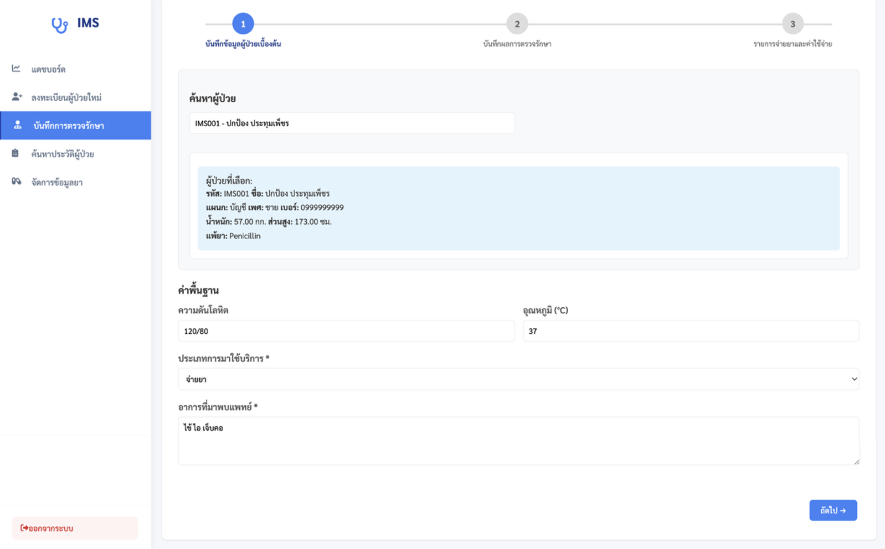
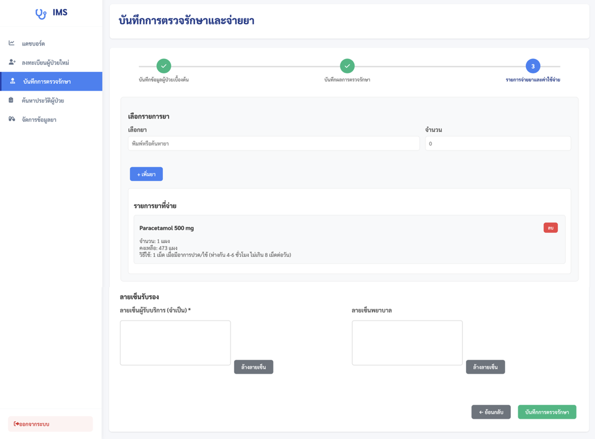
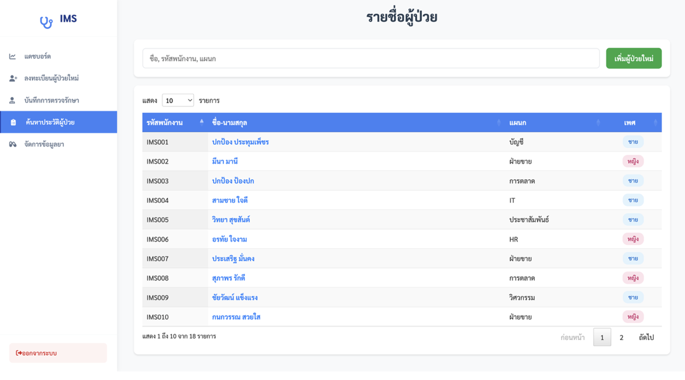
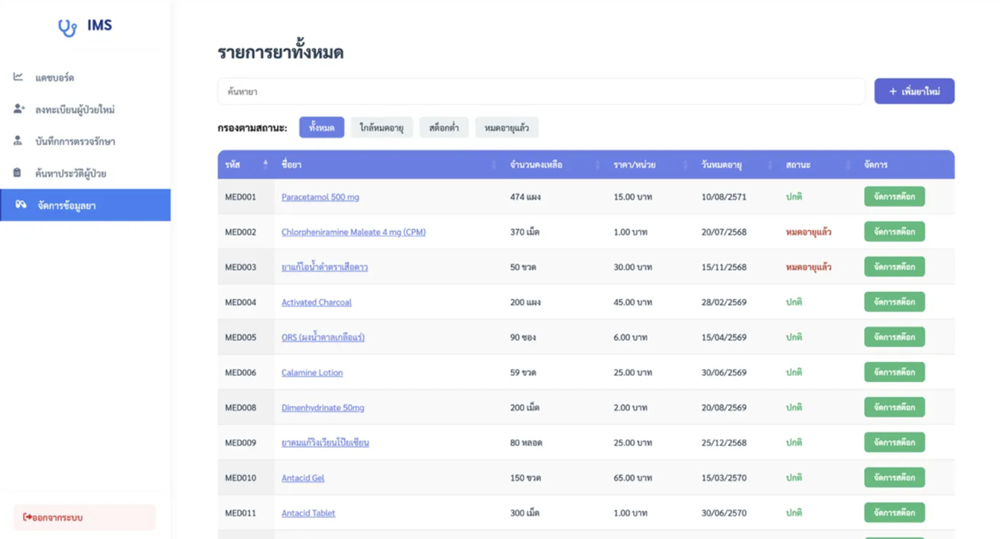

# ระบบการจัดการห้องพยาบาล
**Infirmary Management System**

**ผู้จัดทำโครงงาน:** 
1. ปกป้อง ประทุมเพ็ชร  6309650338  pokpong.prat@dome.tu.ac.th

---

## เทคโนโลยีที่ใช้
**Backend:** Node.js, Express.js, MySQL  
**Frontend:** HTML, CSS, JavaScript, Chart.js, DataTables

---

## ขั้นตอนการติดตั้ง

### 1. ติดตั้ง Software
- [XAMPP](https://www.apachefriends.org) (รวม MySQL)
- [Node.js](https://nodejs.org) 

### 2. Clone โปรเจค
```bash
cd ~/Desktop
git clone https://github.com/ComSciThammasatU/2568-1-cs403-final-submission-67-2_03_tpb-s1.git
cd 2568-1-cs403-final-submission-67-2_03_tpb-s1/IMS
```

### 3. ติดตั้ง Dependencies
```bash
npm install
```

### 4. สร้าง Database
1. เปิด XAMPP → Start **MySQL**
2. เปิด [phpMyAdmin](http://localhost/phpmyadmin)
3. สร้าง Database: `workplace_infirmary_center`
4. Import ไฟล์: **`workplace_infirmary_center.sql`**

### 5. รันระบบ
```bash
npm start
```
เปิดเบราว์เซอร์: **http://localhost:3000**

### Login ทดสอบ
- **รหัสพนักงาน:** `N001`
- **PIN:** `1234`

---

## โครงสร้างโปรเจค
```
IMS/
├── config/          # การตั้งค่า Database
├── routes/          # API Endpoints
├── public/          # Frontend (HTML, CSS, JS)
├── Screenshots/     # ภาพหน้าจอระบบ
├── workplace_infirmary_center.sql  # Database
├── server.js
└── package.json
```

---

## Database (8 ตาราง)
- **staff** - พนักงาน
- **patients** - ผู้ป่วย
- **examinations** - การตรวจรักษา
- **examination_photos** - รูปภาพประกอบการตรวจ
- **medicines** - ข้อมูลยา
- **medicine_lots** - LOT ยา (สต็อก)
- **medicine_dispensed** - รายการจ่ายยา
- **staff_sessions** - ประวัติ Login

---

## การใช้งานระบบ

1. **Login** → กรอกรหัสพนักงาน + PIN
2. **Dashboard** → ดูสถิติการรักษาและกราฟสรุป
3. **ลงทะเบียนผู้ป่วย** → กรอกข้อมูล + เลือกประวัติแพ้ยาและโรคประจำตัว
4. **บันทึกการตรวจ** → ค้นหาผู้ป่วย → วินิจฉัย → จ่ายยา + ลายเซ็น
5. **จัดการยา** → เพิ่มยาใหม่ + จัดการสต็อก LOT + ตรวจสอบวันหมดอายุ
6. **ดูประวัติ** → ตรวจสอบประวัติการรักษาของผู้ป่วยแต่ละคน

---

## Screenshots

<p align="center">
  
  
</p>

<p align="center">
  
  
</p>

<p align="center">
  
  
</p>

<p align="center">
  
  
</p>

<p align="center">
  
  
</p>

<p align="center">
  
</p>

---

## Features หลักของระบบ

- ระบบ Login ด้วย PIN  
- Dashboard แสดงสถิติแบบ Real-time  
- บันทึกการตรวจรักษาแบบ Multi-step
- จัดการประวัติแพ้ยาและโรคประจำตัว  
- ระบบจ่ายยาพร้อมตรวจสอบสต็อก  
- จัดการ LOT ยา (Batch Management)  
- อัปโหลดรูปภาพประกอบการตรวจ  
- ลายเซ็นดิจิทัล (Digital Signature)  
- รายงานและกราฟสถิติ
